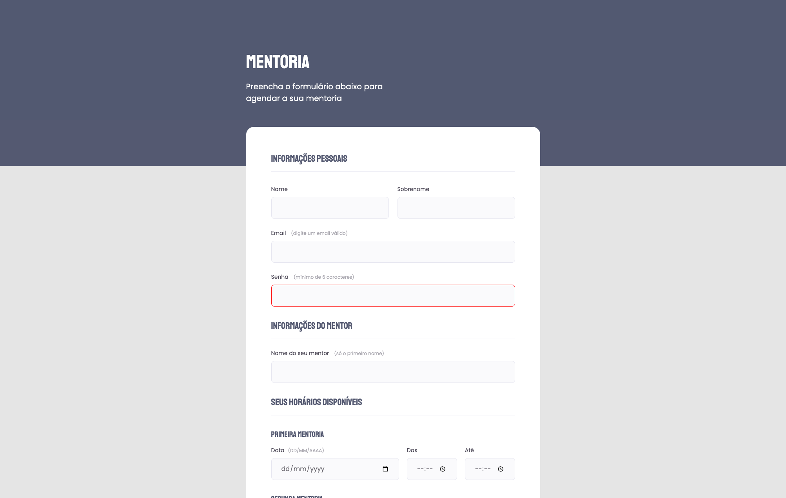

# Desafio Formulário

> Curso Explorer | Rocketseat

Desafio desenvolvido no curso Explorer da rocketseat

* Criando um formulário com os conhecimentos adquiridos no Projero 03

## 🛠 Tecnologias

- HTML
- CSS
- Github

## 📩 Contato

linss.edgar@gmail.com
